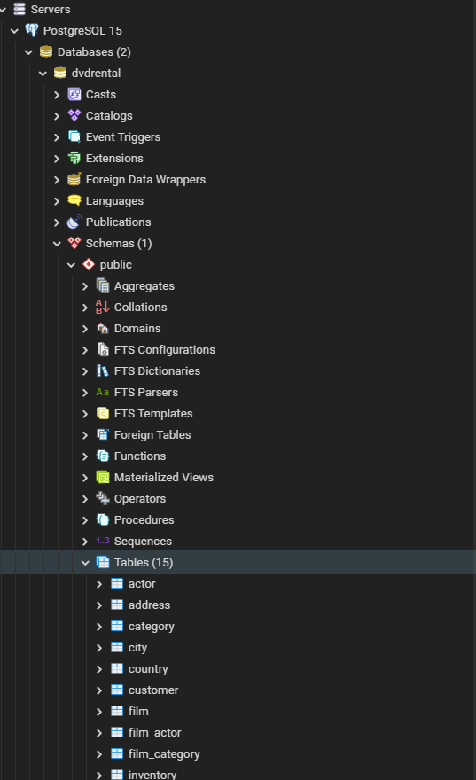

# SQL & Databases

### What are Databases?

**Databases are systems that allow users to store and organize data, they are useful when dealing with large amounts of data**

- columns in a database are similar to the columns in a table contained within a database.
- rows in a database table are also like the rows of a spreadsheet.
- Spreadsheet tabs are similar to database tables.

### What is SQL?

- Structured Query Language
- A language that can be used to communicate with a database

---

### PostgreSQL & PGAdmin

- [PSQL Documentation](https://www.postgresql.org/docs/)

**SQL Cheat Sheet:**


- what PG Admin Looks Like:
  

**Once you have restored the provided .tar file database, you can right click and use the querry tool to query it.**


**Querry Entire Table**

```sql
SELECT * FROM film;
```

---

### SQL Commands:

- `SELECT` - used to select data from a database
- `WHERE` - used to filter a query
- `ORDER BY` - used to sort the results of a query
- `LIMIT` - used to limit the number of results returned by a query
- `JOIN` - used to combine data from multiple tables
- `GROUP BY` - used to group the results of a query together
- `HAVING` - used to filter the results of a query that has been grouped
- `CREATE TABLE` - used to create a new table
- `ALTER TABLE` - used to add, remove, or modify columns in an existing table
- `DROP TABLE` - used to delete an entire table
- `PRIMARY KEY` - used to define a column as a primary key
- `FOREIGN KEY` - used to define a column as a foreign key

**SELECT**

```sql
SELECT column_name FROM table_name;
```

example:

```sql
SELECT description FROM film;
```


**If you want multiple rows from a table you can use a comma to separate the column names**

```sql
SELECT column_name, column_name FROM table_name;
```


**How to view list of tables in your database in PGAdmin**



#### Challenge

- Use select statment to grab the first & last names of every customer and their email address...

```sql
SELECT first_name, last_name, email FROM customer;
```

**SELECT DISTINCT**

- used to return only distinct (different) values
- Sometimes a table contains a column that has duplicate values, and you may want to know what distinct values are stored in that column.

```sql
SELECT DISTINCT column_name FROM table_name;
```

> example:

```sql
SELECT DISTINCT release_year FROM film;
```

**Challenge**

- Use SELECT & DISTINCT to retrieve a list of all the rating types of our films.

```sql
SELECT DISTINCT rating FROM film;
```


### Count
- The COUNT function returns the number of rows that matches a specified criteria.
- We can apply count on a specific column o just pass COUNT(*)
- COUNT() does need the parentheses

```sql
SELECT COUNT (title) from film;
```

- Count is more useful when combined with other commands such as DISTINCT

```sql
SELECT COUNT (DISTINCT rating) from film;
```


- What if we wanted to count the number of distinct payment amounts in the payment table?

```sql
SELECT COUNT(DISTINCT(amount)) FROM payment;
```


### WHERE

- The WHERE statment allows us to specify conditions on columns for the rows we want to return from a query.
- The WHERE clause appears right after the FROM clause of the SELECT statement.
- The WHERE clause can be combined with AND, OR, and NOT operators.

**Comparison Operators**

- `=` equal
- `!=` not equal
- `>` greater than
- `<` less than
- `>=` greater than or equal to
- `<=` less than or equal to
- `BETWEEN` between an inclusive range
- `LIKE` search for a pattern
- `IN` specify multiple possible values for a column
- `IS NULL` check if a value is null
- `IS NOT NULL` check if a value is not null
- `AND` used to combine two or more conditions
- `OR` used to combine two or more conditions
- `NOT` used to negate a condition


**Example**

```sql
SELECT * FROM customer
WHERE first_name = 'Jared';
```


```sql
SELECT * FROM film
WHERE rental_rate > 4;
```
