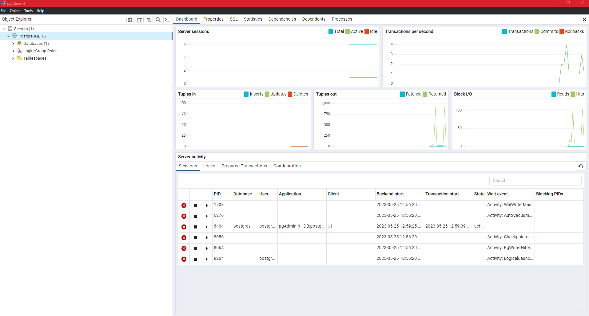
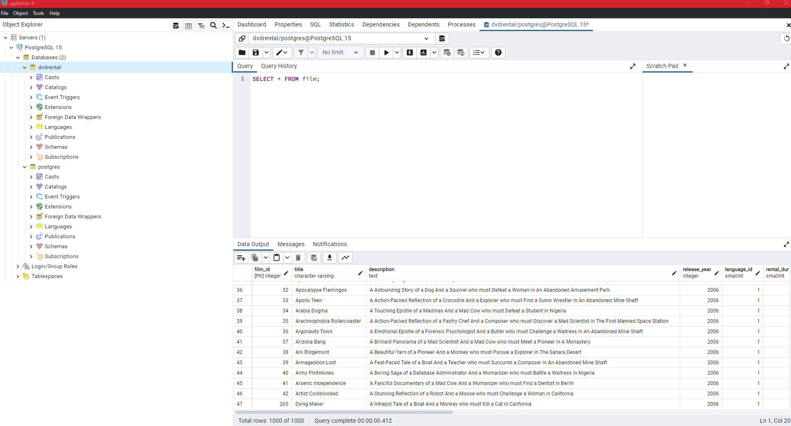
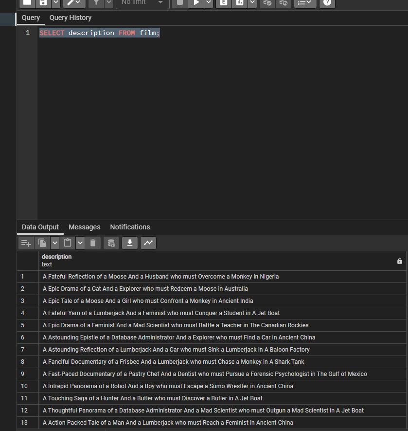
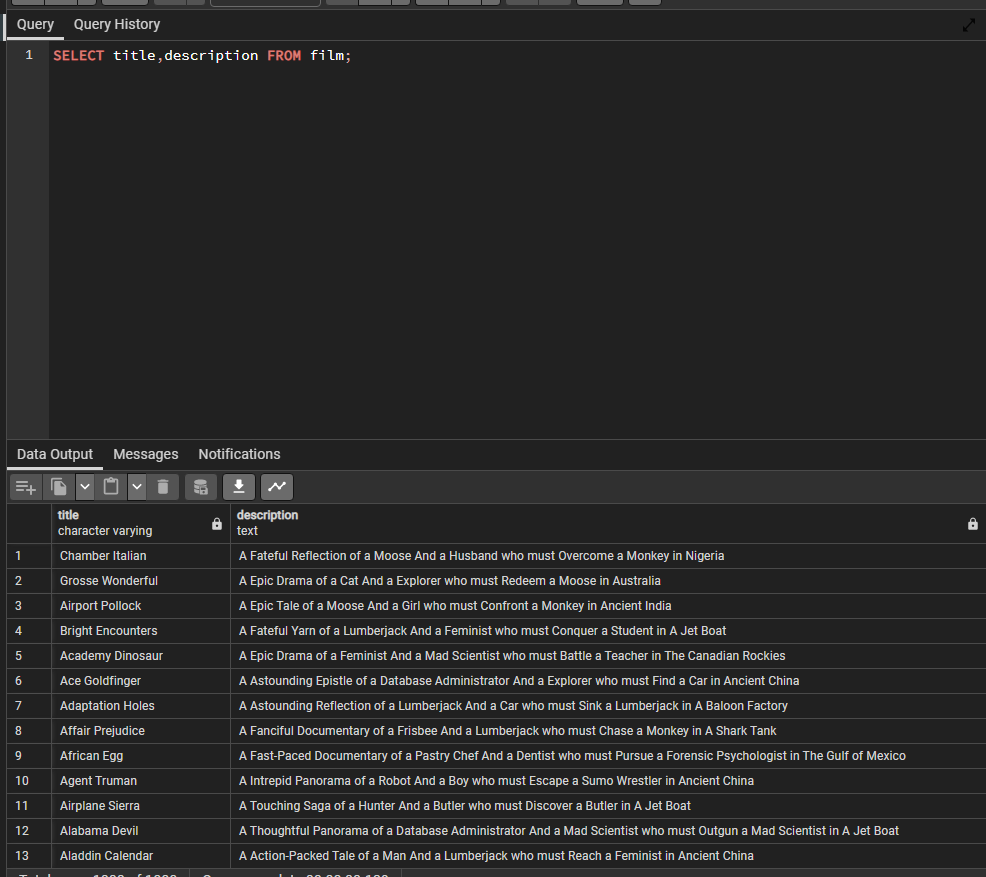
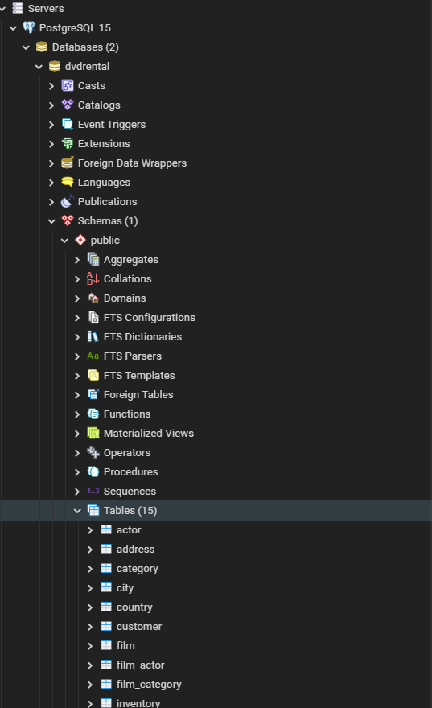
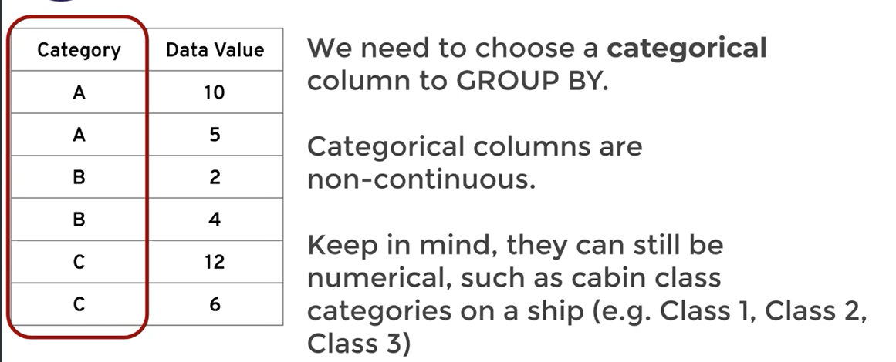
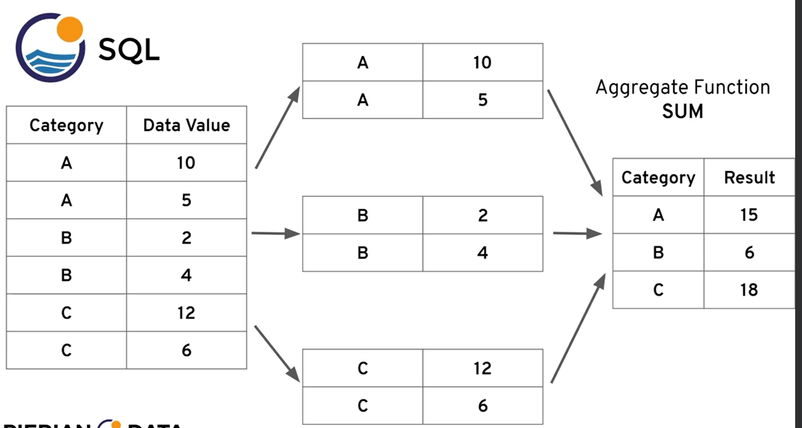
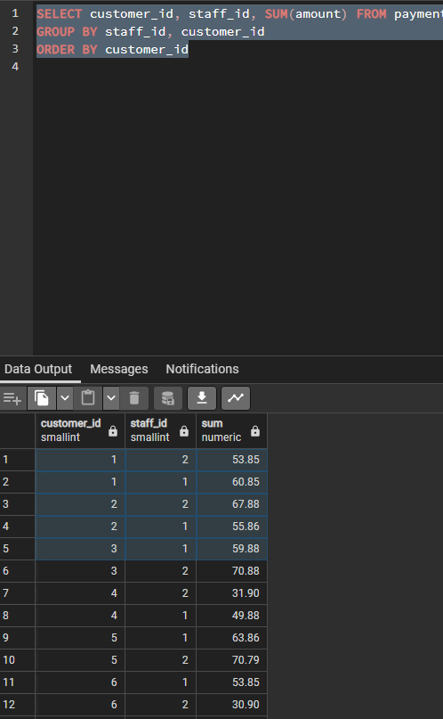

# SQL & Databases

### What are Databases?

**Databases are systems that allow users to store and organize data, they are useful when dealing with large amounts of data**

- columns in a database are similar to the columns in a table contained within a database.
- rows in a database table are also like the rows of a spreadsheet.
- Spreadsheet tabs are similar to database tables.

### What is SQL?

- Structured Query Language
- A language that can be used to communicate with a database

---

### PostgreSQL & PGAdmin

- [PSQL Documentation](https://www.postgresql.org/docs/)

**SQL Cheat Sheet:**


- what PG Admin Looks Like:
  

**Once you have restored the provided .tar file database, you can right click and use the querry tool to query it.**



**Querry Entire Table**

```sql
SELECT * FROM film;
```

---

### SQL Commands:

- `SELECT` - used to select data from a database
- `WHERE` - used to filter a query
- `ORDER BY` - used to sort the results of a query
- `LIMIT` - used to limit the number of results returned by a query
- `JOIN` - used to combine data from multiple tables
- `GROUP BY` - used to group the results of a query together
- `HAVING` - used to filter the results of a query that has been grouped
- `CREATE TABLE` - used to create a new table
- `ALTER TABLE` - used to add, remove, or modify columns in an existing table
- `DROP TABLE` - used to delete an entire table
- `PRIMARY KEY` - used to define a column as a primary key
- `FOREIGN KEY` - used to define a column as a foreign key

**SELECT**

```sql
SELECT column_name FROM table_name;
```

example:

```sql
SELECT description FROM film;
```



**If you want multiple rows from a table you can use a comma to separate the column names**

```sql
SELECT column_name, column_name FROM table_name;
```



**How to view list of tables in your database in PGAdmin**



#### Challenge

- Use select statment to grab the first & last names of every customer and their email address...

```sql
SELECT first_name, last_name, email FROM customer;
```

**SELECT DISTINCT**

- used to return only distinct (different) values
- Sometimes a table contains a column that has duplicate values, and you may want to know what distinct values are stored in that column.

```sql
SELECT DISTINCT column_name FROM table_name;
```

> example:

```sql
SELECT DISTINCT release_year FROM film;
```

**Challenge**

- Use SELECT & DISTINCT to retrieve a list of all the rating types of our films.

```sql
SELECT DISTINCT rating FROM film;
```

### Count

- The COUNT function returns the number of rows that matches a specified criteria.
- We can apply count on a specific column o just pass COUNT(\*)
- COUNT() does need the parentheses

```sql
SELECT COUNT (title) from film;
```

- Count is more useful when combined with other commands such as DISTINCT

```sql
SELECT COUNT (DISTINCT rating) from film;
```

- What if we wanted to count the number of distinct payment amounts in the payment table?

```sql
SELECT COUNT(DISTINCT(amount)) FROM payment;
```

### WHERE

- The WHERE statment allows us to specify conditions on columns for the rows we want to return from a query.
- The WHERE clause appears right after the FROM clause of the SELECT statement.
- The WHERE clause can be combined with AND, OR, and NOT operators.

**Comparison Operators**

- `=` equal
- `!=` not equal
- `>` greater than
- `<` less than
- `>=` greater than or equal to
- `<=` less than or equal to
- `BETWEEN` between an inclusive range
- `LIKE` search for a pattern
- `IN` specify multiple possible values for a column
- `IS NULL` check if a value is null
- `IS NOT NULL` check if a value is not null
- `AND` used to combine two or more conditions
- `OR` used to combine two or more conditions
- `NOT` used to negate a condition

**Example**

```sql
SELECT * FROM customer
WHERE first_name = 'Jared';
```

```sql
SELECT * FROM film
WHERE rental_rate > 4;
```

```sql
SELECT * FROM film
WHERE rental_rate > 4 AND replacement_cost >= 19.99;
```

```sql
SELECT * FROM film
WHERE rental_rate > 4 AND replacement_cost >= 19.99
AND rating = 'R';
```

- If we just wanted the titles from the rows that matched the previous conditions:

```sql
SELECT title FROM film
WHERE rental_rate > 4 AND replacement_cost >= 19.99
AND rating = 'R';
```

- If I want to count the number of titles that the previous querry returns..

```sql
SELECT COUNT(title) FROM film
WHERE rental_rate > 4 AND replacement_cost >= 19.99
AND rating = 'R';
```

- The above code is equivalent to the following:

```sql
SELECT COUNT(*) FROM film
WHERE rental_rate > 4 AND replacement_cost >= 19.99
AND rating = 'R';
```

The column that you count is not important, it is just a way to count the number of rows that match the conditions.

---

### Challenge

> What is the email for a customer with the name Nancy Thomas?

```sql
SELECT email FROM customer
WHERE first_name = 'Nancy' AND last_name='Thomas';
```

**Challenge 2**

> Give me a description for a movie called Outlaw Hanky

```sql
SELECT description FROM film
WHERE title = 'Outlaw Hanky';
```

**Challenge 3**

> Can you get the phone number for the customer who's address is 259 Ipoh Drive?

```sql
SELECT phone FROM address
WHERE address = '259 Ipoh Drive';
```

---

### ORDER BY

- You can use ORDER BY to sort rows based on a column value in either ascending or descending order.
  > Syntax: ORDER BY uses ASC by default.

```sql
SELECT column_1, column_2 FROM table_name
ORDER BY column_1 ASC|DESC;
```

- let's order the customer table by first name...

```sql
SELECT * FROM customer
ORDER BY first_name;
```

- To get the result in descending order:

```sql
SELECT * FROM customer
ORDER BY first_name DESC;
```

- if we want to order by store_id and then by first_name (alphabetically) we can do the following:

```sql
SELECT * FROM customer
ORDER BY store_id, first_name;
```

- If we want to order by store_id (DESC) and then by first_name (ASC) we can do the following:

```sql
SELECT * FROM customer
ORDER BY store_id DESC, first_name;
```

- You can also order by columns you are not selecting:

```sql
SELECT first_name, last_name FROM customer
ORDER BY store_id DESC, first_name;
```

---

### LIMIT

- The LIMIT clause is used to limit the number of rows returned in a query result.
- You can use the LIMIT clause to constrain the number of rows returned by the SELECT statement.
- The LIMIT clause accepts one or two arguments. The values of both arguments must be zero or positive integers.
- If you supply one argument, it must be a positive integer. The query will return the maximum number of rows specified by the integer.
- If you supply two arguments, the first argument must be a zero or positive integer. The query will skip the offset rows before returning the maximum number of rows specified by the second argument.
- LIMIT goes at the end of the query

```sql
SELECT * FROM payment
ORDER BY payment_date
LIMIT 5;
```

> Combining ORDER BY and LIMIT and WHERE

- this gives us the 5 most recent payments that are not 0.00

```sql
SELECT * FROM payment
WHERE amount != 0.00
ORDER BY payment_date DESC
LIMIT 5;
```

---

### Challenge

- What are the customer ids of the first 10 customers who created a payment?

```sql
SELECT customer_id FROM payment
ORDER BY payment_date
LIMIT 10;
```

**Challenge 2**

- What are the titles of the first 5 movies that were rented out?

```sql
SELECT title FROM film
ORDER BY length
LIMIT 5;
```

> above length is highlighted because length is also a SQL keyword...

**Challenge 3**

- If the previous customer can watch any movie that is 50 minutes or less in runtime how many options does she have?

```sql
SELECT COUNT(*) FROM film WHERE length <= 50;
```

> or

```sql
SELECT COUNT(length) FROM film WHERE length <= 50;
```

---

### BETWEEN

- The BETWEEN operator selects values within a given range. The values can be numbers, text, or dates.
- The BETWEEN operator is inclusive: begin and end values are included.
- The BETWEEN operator can be used in any valid SQL statement - select, insert, update, or delete.
- The BETWEEN operator is often used in the WHERE clause of the SELECT, UPDATE, and DELETE statements.

```sql
SELECT * FROM payment
WHERE amount BETWEEN 8 AND 9;
```

> to find how many results matched the above criteria:

```sql
SELECT COUNT(*) FROM payment
WHERE amount BETWEEN 8 AND 9;
```

> Payments between given dates...

```sql
SELECT * FROM payment
WHERE payment_date BETWEEN '2007-02-01' AND '2007-02-15';
```

> When you use the BETWEEN operator with date values, keep in mind that the BETWEEN operator is inclusive but the date values themselves are not. So in the example above `2007-02-15` does not include any payments that were made on that date.

---

### IN

- We can use the IN operator to create a condition that checks to see if a value matches any value in a list of values.
- The IN operator is often used in the WHERE clause of the SELECT, UPDATE, and DELETE statements.
  > example:

```sql
SELECT color FROM table
WHERE color IN ('red', 'blue', 'green');
```

> in the above example we are looking for rows where the color is either red, or blue, or green.

- you can also negate the IN operator with NOT

```sql
SELECT color FROM table
WHERE color NOT IN ('red', 'blue', 'green');
```

> in the above example we are looking for rows where the color is not red, or blue, or green.

**Real Example With Our Database**

```sql
SELECT * FROM payment
WHERE amount IN (0.99,1.98,1.99)
ORDER BY amount;
```

- to find the number of payments where the ammount is not 0.99, 1.98, or 1.99

```sql
SELECT COUNT(*) FROM payment
WHERE amount NOT IN (0.99,1.98,1.99);
```

- find all customers where the first name is either John, Jake, or Julie

```sql
SELECT * FROM customer
WHERE first_name IN ('John', 'Jake', 'Julie');
```

---

### LIKE and ILIKE

- The LIKE operator is used in a WHERE clause to search for a specified pattern in a column.
- There are two wildcards often used in conjunction with the LIKE operator:

  - % - The percent sign represents zero, one, or multiple characters
  - \_ - The underscore represents a single character

- we can use the LIKE operator to match patterns like all emails ending in gmail.com or all names that start with the letter A.

- all names that begin with the letter A

```sql
SELECT * FROM customer
WHERE first_name LIKE 'A%';
```

- all names that end with the letter A

```sql
SELECT * FROM customer
WHERE first_name LIKE '%a';
```

**Note that LIKE is case-sensitive if you want a case-insensative match you can use ILIKE**

- using the underscore allows us to replace just a single character...

> i.e. get all Mission Impossible films

```sql
WHERE title LIKE 'Mission Impossible _';
```

[REGEX is PSQL](https://www.postgresql.org/docs/15/functions-matching.html)

**Example**

> Find all customers who's name starts with J

```sql
SELECT first_name FROM customer
WHERE first_name LIKE 'J%';
```

> Find all customers who's name starts with J and last name starts with S

```sql
SELECT first_name, last_name FROM customer
WHERE first_name LIKE 'J%' AND last_name LIKE 'S%';
```

- find people who have the sequence of characters `er` in their first name

```sql
SELECT first_name FROM customer
WHERE first_name LIKE '%er%';
```

- if you want to narrow it down to people who's first name starts with some letter and followed by the sequence of characters `er` in their first name

```sql
SELECT first_name FROM customer
WHERE first_name LIKE '_er%';
```

- find all customers who's first name starts with an A and who's last name doesn't end with an B

```sql
SELECT first_name, last_name FROM customer
WHERE first_name LIKE 'A%' AND last_name NOT LIKE 'B%'
ORDER BY last_name;
```

---

### Challenge

- How many payment transactions were greater than $5.00?

```sql
SELECT COUNT(*) FROM payment
WHERE amount > 5
```

- How many actors have a first name that starts with the letter P?

```sql
SELECT COUNT(*) FROM actor
WHERE first_name LIKE ('P%')
```

- How many unique districts are our customers from?

```sql
SELECT COUNT (DISTINCT(district)) FROM address;
```

- Retrieve list of names for those distinct districts from the previous question

```sql
SELECT DISTINCT(district) FROM address;
```

- How many films have a rating of R and a replacement cost between $5 and $15?

```sql
SELECT COUNT (*) FROM film
WHERE rating = 'R' AND replacement_cost BETWEEN 5 AND 15;
```

- How many films have the word Truman somewhere in the title?

```sql
SELECT COUNT (*) FROM film
WHERE title LIKE '%Truman%';
```

---

### Aggregate Functions

- The main idea of an aggregate function is that it takes multiple values and returns a single value.

[Aggregate Functions](https://www.postgresql.org/docs/15/functions-aggregate.html)

**Most Common Aggregate Functions**

- AVG() - Returns the average value. AVG returns a floating point value, you can use ROUND to specify precision after the decimal point.
- COUNT() - Returns the number of rows. COUNT simply returns the number of rows, which means by convention we just use count(\*) to count all rows.
- FIRST() - Returns the first value.
- LAST() - Returns the last value.
- MAX() - Returns the largest value.
- MIN() - Returns the smallest value.
- SUM() - Returns the sum.

**Aggregate Functions calls happen only in the SELECT clause or in the HAVING clause**

> examples:

```sql
SELECT MIN(replacement_cost) FROM film;
```

```sql
SELECT AVG(replacement_cost) FROM film;
```

- to round the above result to 2 decimal places

```sql
SELECT ROUND(AVG(replacement_cost),2) FROM film;
```

---

## GROUP BY:

- Group By allows us to aggregate (reduce multiple values into a single value) columns per some category.





**Basic Syntax**

```sql
SELECT category_col , AGG(data_col)
FROM table
GROUP BY category_col
```

- The GROUP BY lause must appear right after a FROM or WHERE statment.

> Example using WHERE statment:

```sql
SELECT category_col , AGG(data_col)
FROM table
WHERE category_col != 'A'
GROUP BY category_col
```

- Basic Example using our Local Database:

```sql
SELECT customer_id, SUM(amount) FROM payment
GROUP BY customer_id
ORDER BY SUM(amount)
```

> Example using two columns:

- In this example the order of columns in the select statment does not matter but the order of the coulumns in the Group By does matter.

```sql
SELECT customer_id, staff_id, SUM(amount) FROM payment
GROUP BY staff_id, customer_id
ORDER BY customer_id
```



- When the date is listed as a time stamp you need to use a special date function to convert it to a date that you can group by.

```sql
SELECT DATE(payment_date) FROM payment
```

- The code above will give you just the date without the hour/minute/second.

> Grouping by payment date and orderin by sum of payments on said dates:

```sql
SELECT DATE(payment_date), SUM(amount) FROM payment
GROUP BY DATE(payment_date)
ORDER BY SUM(amount) DESC
```

**Comments in SQL:**

1.  **Single-Line Comments**:

    - You can start a single-line comment with `--`, and everything following this on the same line will be a comment.
    - Example:

      sqlCopy code

      `-- This is a single-line commentSELECT * FROM users;`

2.  **Multi-Line Comments**:

    - For multi-line comments, you use `/*` to start the comment and `*/` to end it. Everything between these will be considered a comment.
    - Example:

      sqlCopy code

      `/* This is a multi-line commentIt can span multiple lines */SELECT * FROM users;`

- Both types of comments are ignored by the SQL engine when executing the script. You can use comments to explain parts of your SQL code, make notes for yourself or others, or temporarily disable parts of the SQL code without deleting it.
