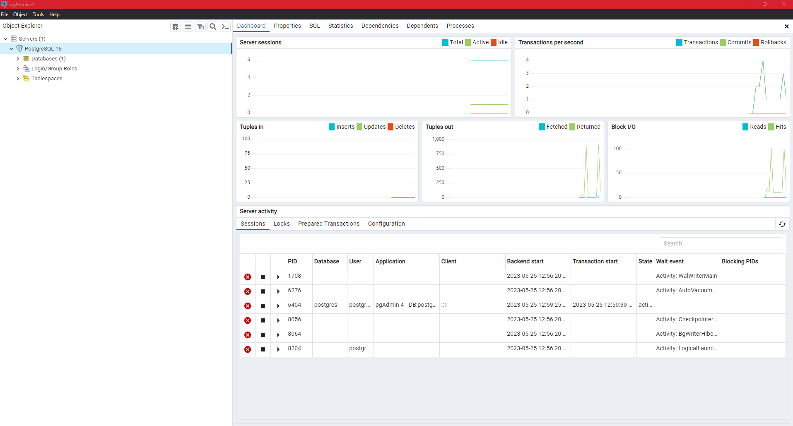
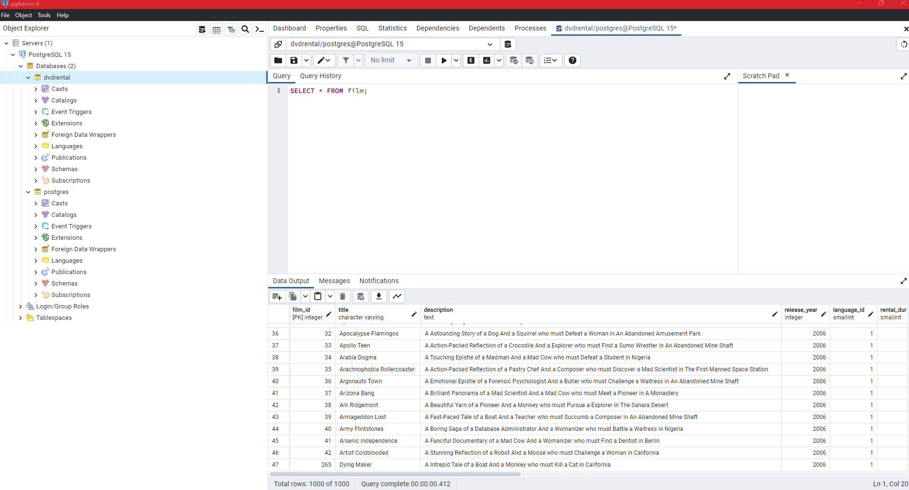
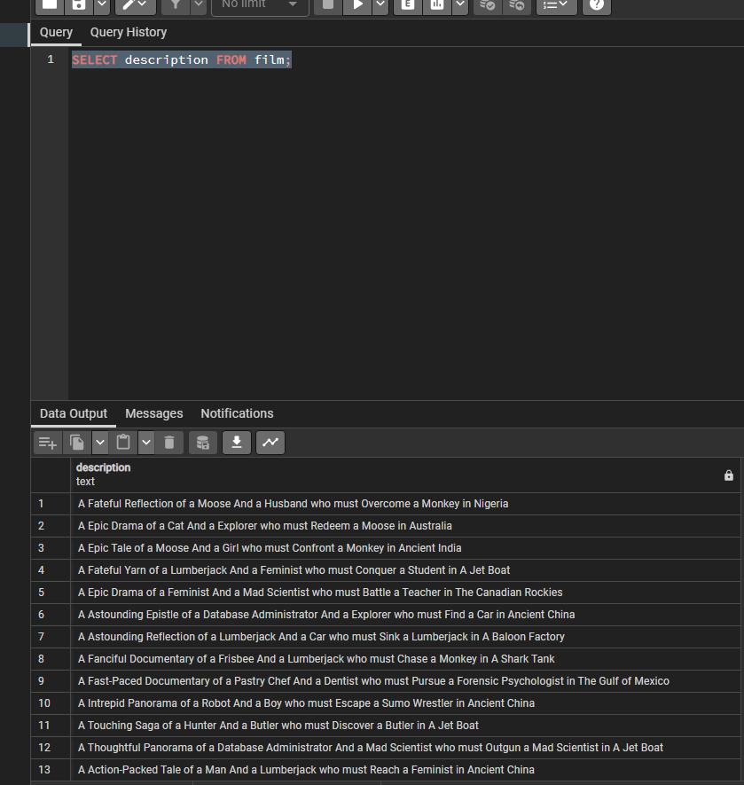

# SQL & Databases

### What are Databases?

**Databases are systems that allow users to store and organize data, they are useful when dealing with large amounts of data**

- columns in a database are similar to the columns in a table contained within a database.
- rows in a database table are also like the rows of a spreadsheet.
- Spreadsheet tabs are similar to database tables.

### What is SQL?

- Structured Query Language
- A language that can be used to communicate with a database

---

### PostgreSQL & PGAdmin

- [PSQL Documentation](https://www.postgresql.org/docs/)

**SQL Cheat Sheet:**


- what PG Admin Looks Like:
  

**Once you have restored the provided .tar file database, you can right click and use the querry tool to query it.**



**Querry Entire Table**

```sql
SELECT * FROM film;
```

---

### SQL Commands:

- `SELECT` - used to select data from a database
- `WHERE` - used to filter a query
- `ORDER BY` - used to sort the results of a query
- `LIMIT` - used to limit the number of results returned by a query
- `JOIN` - used to combine data from multiple tables
- `GROUP BY` - used to group the results of a query together
- `HAVING` - used to filter the results of a query that has been grouped
- `CREATE TABLE` - used to create a new table
- `ALTER TABLE` - used to add, remove, or modify columns in an existing table
- `DROP TABLE` - used to delete an entire table
- `PRIMARY KEY` - used to define a column as a primary key
- `FOREIGN KEY` - used to define a column as a foreign key


**SELECT**

```sql
SELECT column_name FROM table_name;
```

example:

```sql
SELECT description FROM film;
```



